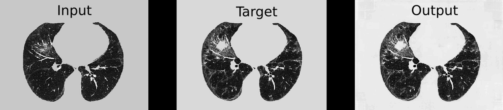
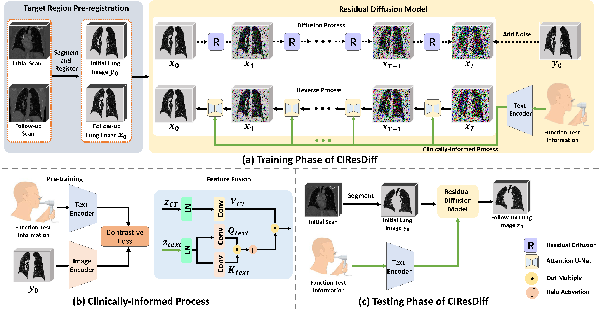

# CIResDiff: A Clinically-Informed Residual Diffusion Model for Predicting Idiopathic Pulmonary Fibrosis Progression
This repo contains the supported pytorch code and configuration files of our work

## Generated Samples by our CIResDiff


## Overview of our CIResDiff



## Results of comparative experiments


# System Requirements
This code has been tested on Ubuntu 20.04 and an NVIDIA Tesla A100 GPU. Furthermore it was developed using Python v3.8. 


# Setup
In order to run our model, we suggest you create a virtual environment 
```
conda create -n CIResDiff python=3.8
``` 
and activate it with 
```
conda activate CIResDiff
```
Subsequently, download and install the required libraries by running 
```
pip install -r requirements.txt
```


# Acknowledgement
This code is heavily build on the following repositories:

(1) https://github.com/lucidrains/denoising-diffusion-pytorch

(2) https://github.com/lucidrains/video-diffusion-pytorch

(3) https://github.com/FirasGit/medicaldiffusion